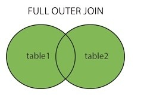

```{r setup, include=FALSE}
knitr::opts_chunk$set(echo = TRUE)
```

Az R egyik nagy ereje a külső fejlesztőlk által szolgáltatott csomagok. Habár az R eleve egy viszonylag magas szintű programozási nyelv, (a legalacsonyabb szint amikor a processzorokat közvetlenül programozzák. Ennél magasabb szint az, amikor már egy több processzoron is használható nyelven írják a programot, viszont még az adatok memóriafoglalását, a feladatok ütemezését szabályozni kell. Az R-ben sem a processzorral, sem a memóriával nem kell közvetlenül foglalkozni.) azonban erre is egyre tovább és tovább épülnek szintek; ennek egy manifesztációja a tidyverse - például a legtöbb esetben a csomag használatának során nem segít _annyira_ sokat az adat struktúrájának ismerete, mint az alap R nyelv esetében.

## Pipe-ok ?s egyt?bl?s parancsok

Az adatok sosem a megfelelő állapotban érkeznek, mindig kell rajtuk tisztítani, illetve bővíteni is érdemes őket. A `pipe` segítségével recept-szerűen le tudjuk írni az adattisztítás folyamatát, így maga a kód is magyarázni tudja, mit csinál. A `pipe` jelét érdemes _utána_-ént olvasni.

```{r pipes_filter_select}
library(tidyverse)
library(gapminder)
data(gapminder)

# Milyen adatok vannak a táblában?
str(gapminder)

# V?lasszuk ki az európai országokat!
europeans <- gapminder %>%
  filter(continent == "Europe")
str(europeans)

# válasszuk ki ország, várható élettertam, egy főre eső GDP és a népességszám oszlopokat!

country_data <- europeans %>%
  select(country, lifeExp, gdpPercap, pop)

# Ha a várható ?lettartamra mégsincs szükség, szedjük ki azt a többi közül:
country_data <- country_data %>%
  select(-lifeExp)
```
E két parancssal jelentősen leszűkíthetjük a felhasználandó adatok körét - ezt nagy t?bl?k eset?n min?l hamarabb ?rdemes megtenni, ?gy a sz?m?t?sok sokkal gyorsabban tudnak lefutni.

### M?veletek elv?gz?se t?bb csoportra

Term?szetesen az adatokat nem csak v?gni sz?ks?ges, hanem b?v?teni is ?j v?ltoz?kkal, Ehhez a `mutate` ?s a `summarise` ad igen sz?lesk?r? t?mogat?st. El?bbi a kiindul? adattal azonos mennyis?g? adatot ad vissza, m?g ut?bbi egyetlen ?rt?kk? t?m?r?ti ?ket.

```{r mutate}

# Sz?moljuk ki minden európai ország teljes GDP-j?t minden ?vben!
europeans <- europeans %>%
  mutate(full_gdp = pop * gdpPercap)
plot(density(europeans$full_gdp))

# Sz?moljuk ki az ?tlagos egy f?re jut?, illetve az ?sszes megtermelt javat!
europeans %>%
  summarise(mean_gdp = mean(gdpPercap) / 12,
            all_gdp = sum(full_gdp))
```


Ezzel a m?dszerrel minden ?sszehasonl?t?shoz k?l?n t?bl?t k?ne l?trehozni. Ennek elker?l?s?re ?sz?lt a `group_by` f?ggv?nyt, ami a h?tt?rben megjegyzi, milyen v?ltoz?k szerint szeretn?nk elv?gezni egy-egy ?sszes?t?st.

```{r mutate2}

# Sz?moljuk ki minden országnak az ?tlagos ?ves ?sszes GDP-j?t!
eur_mn_gdp <- europeans %>%
  group_by(country) %>%
  summarise(GDP_per_year = mean(full_gdp))

# Gyakran csak a legnagyobb/legisebb ?rt?kekre vagyunk k?v?ncsiak az erem?nyb?l:
eur_mn_gdp %>% arrange(desc(GDP_per_year))

# Az ?sszes?tett ?rt?ket az egyes sorokhoz is hozz??rhatjuk:
europeans %>%
  group_by(country) %>%
  mutate(country_mean = mean(full_gdp))
```


## Sz?les ?s hossz? adatok

Az adatok elemi r?szelre bont?sa sosem olyan egy?rtelm? feladat, mint amilyennek l?tszik: a `gapminder` adatok eset?n egy sorban h?rom m?r?s is szerepel (v?rhat? ?letkor, egy f?re es? GDP ?s lakoss?g), ezzel jelezve, hogy e h?romnak az ?sszef?gg?se volt a legalkalmasabb a kutat?sra, amihez az adatokat gy?jt?tt?k. Azonban enn?l elemibben is elt?rolhat? az adat, ha egy sorban csak egy m?r?st t?rolunk, ez az adatok _hossz?_ form?tuma. ?gy egy m?r?s minden jellemz?je k?l?n oszlopban szerepel, ?gy az adat k?nnyen sz?rhet?.

```{r long_data}
long_gapminder <- gapminder %>%
  gather(key = property,
         value = value,
         -continent, -country, -year)
str(long_gapminder)
```

Ennek ellent?te az adatok sz?les form?tuma - ez akkor hasznos, ha szeretn?nk hogy egy kutat?si egys?get ?rjon le egy sor, ?s nem egyetlen m?r?st. Ilyenb?l indult ki az eredeti adat.

```{r wide_data}

# ?ll?tsuk el? az eredeti ?llapotot
long_gapminder %>%
  spread(property, value)

```

## Adatt?bl?k kapcsol?sa

Az adatok t?rol?s?n?l fontos, hogy viszonylag kis helyen f?rjenek el - ?s l?thattuk, hogy mind a hossz?, mind a sz?les form?tum hordoz redund?ns inform?ci?t. Ennek megold?sa ?ltal?ban az hogy hogy t?bb t?bl?ban t?roljuk az inform?ci?t: a Gapminder adatok eset?ben lehet egy országokra vonatkoz? ?s egy m?r?sekre vonatkoz? t?bla:

```{r splitting_gapminder}
countries <- long_gapminder %>%
  select(country, continent) %>% # országadatok kiv?laszt?sa
  unique() %>% # egyedi országok megtart?sa
  arrange(country) %>% # bet?rend alapj?n rendez?s
  mutate(id = row_number((country))) # azonos?t?

gdp_data <- long_gapminder %>%
  group_by(year, property) %>% # sz?ks?ges redund?ns inform?ci?k
  mutate(country_id = country %>%                      # ország oszlop
                      unique %>%                       # egyedi ?rt?kek
                      rank(ties.method = "first")) %>% # sorsz?mad?s
  select(country_id, year, property, value) %>% # megtartani k?v?nt inform?ci?k
  spread(property, value) %>% # megfigyel?sek v?ltoz?nk?nt val? sz?tszed?se
  ungroup() # group_by hat?stalan?t?sa
```

Ilyesmi t?blamegoszt?s lehet p?ld?ul a egy kohorsz kutat?sban a demogr?fiai adatok ?s az egyes k?rd??vekre adott v?laszok t?bl?i, de ilyen p?ld?ul b?rmelyik weboldal felhaszn?l?i adatokat ?s felhaszn?l?i aktivit?sokat t?rol? adatb?zisa is. Hab?r ezek a t?rol?s szempontj?b?l ?rtelmes d?nt?sek, a feldolgoz?st megnehez?ti.

Két különböző tábla összekapcsolása az `SQL`-t ismerőknek _join_, az adatos körökben sokan ismerhetitek _merge_-ként. A művelet lényege, hogy két különböző t?bl?b?l ?sszerakja eg t?bl?ba az oszlopokat, azonban a megfelel? sorok ?ssze legyenek p?ros?tva egy (vagy t?bb) azonos?t? alapj?n. H?rom alapvet? fajt?ja l?tezik:

 - inner join: csak a mindk?t adatt?bl?ban szerepl? rekordokat szerepelteti az eredm?nyben. Minden ism?tl?d? ?rt?ket felt?ntet.
 
 - left / right join: az egyik adatt?bl?b?l minden ?rt?khez keres ?rt?ket a m?sik t?bl?ban. Ha nincs hozz? tartoz? ?rt?k, NA az eredm?ny.
 
 - full join: mindk?t t?bla minden sor?t megtartja, amihez nem tal?l p?rt, NA-val t?lti fel.
 
L?tezik k?t m?sik `join` m?velet is a `dplyr` vil?g?ban: a _semi_ ?s _anti_ join. El?bbi az egyik t?bl?b?l megtartja, a m?sik eldobja azokat a sorokat, amik benne vannak a m?sik t?bl?ban, viszont a m?sik t?bla oszlopait nem ?rja hozz? az els?h?z. E k?t m?velet a `filter` f?ggv?nnyel is megoldhat? volna, azonban ?gy sokkal hat?konyabb (gyorsabb ?s kevesebb mem?ri?t haszn?l)

```{r joins}

# v?lasszuk ki a 100-n?l kisebb id-val rendelkez? m?r?seket, illetve az európai országokat:
country_europe <- countries %>%
  filter(continent == "Europe")

gdp_smaller_100 <- gdp_data %>%
  filter(country_id < 100)

# csak párosítsuk össze azokat, amelyik országok mindkét táblázatban szerepelnek:
inner <- country_europe %>%
  inner_join(gdp_smaller_100,
             by = c("id" = "country_id"))
inner %>%
  summarise(n_distinct(country))
str(inner)


# párosítsuk minden országhoz gdp adatot, ha van
left <- country_europe %>%
  left_join(gdp_smaller_100,
             by = c("id" = "country_id"))
left %>% summarize_all(function(x){
                         mean(is.na(x))
                       })
left %>% summarize_all( ~ mean(is.na(.)))
str(left)

# Minden ismert országnevet és minden ismert adatot párosítsunk össze!
full <- country_europe %>%
  full_join(gdp_smaller_100,
             by = c("id" = "country_id"))
full %>% summarize_all( ~ mean(is.na(.)))
str(full)
```
